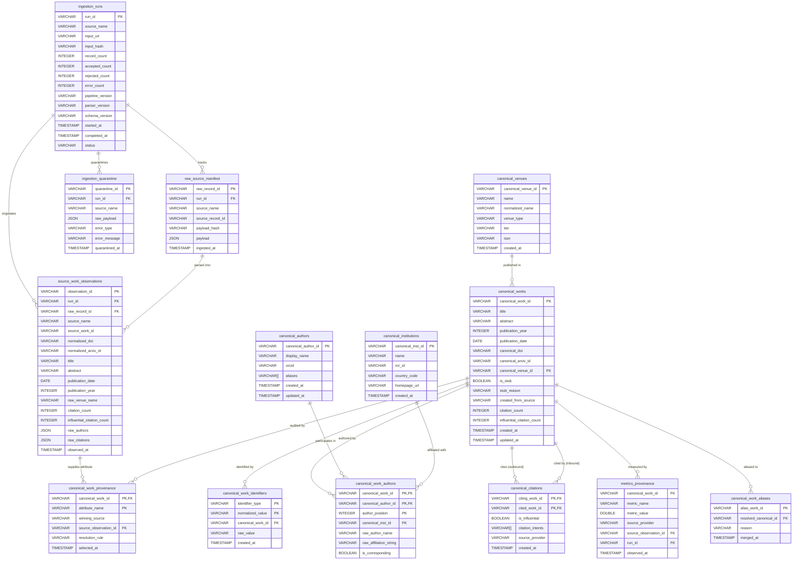

# Scholarly Data Platform Architecture & Database Design

---

## 1. Executive Summary & Goals

### 1.1 Core Goals
The **Canonical Scholarly Data Platform** is the high-integrity analytical ingestion, harmonization, and canonical data storage subsystem for the *Technological Trend Mining* project. Powered by an embedded **DuckDB** OLAP engine, it provides:
1. **Multi-Source Ingestion**: Reliable, idempotent ingestion of scholarly records from **arXiv**, **OpenAlex**, **Crossref**, and **Semantic Scholar (S2AG)**.
2. **Canonical Entity Harmonization**: Deterministic entity resolution that synthesizes heterogeneous source observations into unified canonical representations for Works, Authors, Institutions, and Venues.
3. **Lossless Multi-Tier Lineage & Provenance**: Full auditability tracing every canonical attribute back to its exact `source_observation_id`, `run_id`, source observation timestamp, and raw payload hash.
4. **Citation Graph Integrity & Stub Upgrade Lifecycle**: Robust representation of the directed citation graph handling open-world dangling edges via stub entities (`is_stub = TRUE`) and seamless in-place upgrade when target metadata is ingested.
5. **High-Performance Analytics**: Sub-second analytical SQL execution for technological trend mining queries, citation velocity computations, and venue authority scoring.

### 1.2 Non-Goals (Explicit Boundaries)
* **No Real-Time Streaming Message Brokers**: The system operates on batch and micro-batch ingestion (JSONL files, API dumps). Kafka/Flink are non-goals.
* **No Premature External Graph / Vector Databases**: DuckDB natively handles the citation graph traversal and tabular metadata. External deployment of Neo4j or Qdrant is deferred until embedding-based search or multi-hop graph mining exceeds DuckDB's in-process capabilities.
* **No Distributed Spark/Hadoop Infrastructure**: The target dataset size (up to tens of millions of records) is handled on single-node hardware via DuckDB's vectorized columnar engine.
* **No Live Web Crawling or PDF Full-Text Scraping**: Ingestion operates strictly over structured/semi-structured API metadata payloads.

---

## 2. Requirements & Constraints

### 2.1 Functional Requirements
* **FR-01 (Run-Level Lineage)**: Every ingestion operation creates an immutable `ingestion_runs` record tracking input URI, SHA-256 hash, pipeline/parser/schema versions, and record counts.
* **FR-02 (Multi-Source Parsing)**: Support ingestion from arXiv OAI-PMH JSON/XML dumps, OpenAlex REST JSON/S3 dumps, Crossref JSON, and Semantic Scholar S2AG JSONL.
* **FR-03 (Canonical Work Resolution)**: Unify records presenting identical DOIs or identical arXiv IDs into a single canonical work entity.
* **FR-04 (Stub-to-Canonical Upgrade)**: Automatically upgrade citation stub entities (`is_stub = TRUE`) to fully populated canonical works when matching source metadata arrives, preserving existing foreign keys.
* **FR-05 (Quarantine & Rejection)**: Divert malformed or invalid records to `ingestion_quarantine` without halting batch execution.
* **FR-06 (Citation Graph Traversal)**: Support fast inbound and outbound citation graph traversal with support for citation intents (`Methodology`, `Background`, `Result`) and influential flags.
* **FR-07 (Temporal Metrics Snapshots)**: Track historical observation of time-varying metrics (e.g., `citation_count`, `influential_citation_count`) with observation timestamps.
* **FR-08 (Deterministic Idempotency)**: Re-running ingestion on any file or batch must not duplicate rows, alter surrogate keys, or corrupt referential integrity.

### 2.2 Non-Functional Requirements & Constraints
* **NFR-01 (ACID Consistency)**: Ingestion batches must commit atomically within DuckDB transactions (`BEGIN TRANSACTION ... COMMIT`).
* **NFR-02 (Vectorized Columnar Storage)**: Golden analytical tables must reside in native DuckDB columnar formats with optimal compression and min/max zone maps.
* **NFR-03 (Auditability & Reproducibility)**: Given any canonical work, the system must identify which sources observed it and which source observation supplied each attribute.
* **NFR-04 (Single-Writer Concurrency)**: Comply with DuckDB's architectural model: serialize all write transactions while permitting concurrent analytical reads.
* **NFR-05 (Pinned Dependency)**: Engine version is strictly pinned to `duckdb==1.5.5` in `pyproject.toml` and verified through `uv.lock`.

---

## 3. System Architecture & Component Topology

```mermaid
flowchart TD
    subgraph Data Sources
        S_ARXIV[arXiv OAI-PMH / JSON]
        S_OA[OpenAlex JSON / S3]
        S_CR[Crossref API / JSON]
        S_S2[Semantic Scholar S2AG JSONL]
    end

    subgraph Bronze Layer: Hybrid Raw Files & Manifest
        B_FILES[(Immutable Raw Files<br/>data/bronze/...)]
        B_RUNS[ingestion_runs<br/>run_id, source, input_hash, versions, counts]
        B_RAW[raw_source_manifest<br/>manifest_id, run_id, payload_hash, payload]
        B_QUAR[ingestion_quarantine<br/>quarantine_id, run_id, payload, error_type]
    end

    subgraph Silver Layer: Normalized Observations
        OBS_W[source_work_observations<br/>observation_id, run_id, source_work_id, typed attrs]
        OBS_C[source_citation_observations<br/>citing_id, cited_id, intents, is_influential]
        OBS_A[source_author_observations<br/>raw_name, raw_affiliation, orcid, ror]
    end

    subgraph Resolution Engine
        RES_NORM[Identifier Normalizer: DOI, arXiv, ORCID, ROR]
        RES_MATCH[Deterministic Multi-Pass Entity Resolver]
        RES_POL[Source Authority Priority Matrix]
        RES_STUB[Stub Creation & In-Place Upgrade Engine]
    end

    subgraph Gold Layer: Canonical Relational Core
        C_WORKS[canonical_works<br/>canonical_work_id, title, is_stub, canonical_doi]
        C_IDENT[canonical_work_identifiers<br/>id_type, normalized_value, canonical_work_id]
        C_AUTHORS[canonical_authors<br/>canonical_author_id, display_name, orcid]
        C_INST[canonical_institutions<br/>canonical_inst_id, name, ror_id]
        C_VENUES[canonical_venues<br/>canonical_venue_id, name, tier]
        C_WA[canonical_work_authors<br/>canonical_work_id, canonical_author_id, position]
        C_CITES[canonical_citations<br/>citing_work_id, cited_work_id, is_influential]
        C_PROV[canonical_work_provenance<br/>canonical_work_id, attribute_name, source_observation_id]
        C_METRICS[metrics_provenance<br/>canonical_work_id, metric_name, value, observed_at, run_id]
    end

    subgraph Downstream Analytics
        A_TRENDS[Technological Trend Mining Engine]
        A_VELOCITY[Citation Velocity & Acceleration]
        A_NETWORKS[Co-Authorship & Institution Networks]
    end

    Data Sources -->|Raw Landing & Hash| B_FILES
    B_FILES -->|Register Run| B_RUNS
    B_FILES -->|Stream JSONL| B_RAW
    B_RAW -->|Schema Parsing & DQ Gates| Silver Layer
    B_RAW -.->|Malformed / Invalid| B_QUAR
    Silver Layer --> RES_NORM
    RES_NORM --> RES_MATCH
    RES_MATCH --> RES_POL
    RES_POL --> RES_STUB
    RES_STUB -->|Deterministic Atomic Transaction| Gold Layer
    Gold Layer --> Downstream Analytics
```

---

## 4. End-to-End Data Flow

```mermaid
sequenceDiagram
    autonumber
    participant SRC as External Source / File (JSONL)
    participant ING as Ingestion Coordinator
    participant RUN as Bronze: ingestion_runs
    participant RAW as Bronze: raw_source_manifest
    participant QUAR as Bronze: ingestion_quarantine
    participant OBS as Silver: source_work_observations
    participant RES as Resolution & Stub Engine
    participant GOLD as Gold: Canonical Tables (DuckDB)

    ING->>RUN: 1. Create ingestion_run (RECORDING_STARTED, input_hash, versions)
    ING->>RAW: 2. Stream raw file payloads; verify SHA-256 hash
    alt Malformed Payload or Critical DQ Failure (DQ-02)
        ING->>QUAR: Divert record to quarantine with error_type & message
    else Valid Payload
        ING->>OBS: 3. Insert typed observation (linked to run_id & source_work_id)
        OBS->>RES: 4. Extract normalized source keys (doi, arxiv, s2)
        RES->>GOLD: 5. Query canonical_work_identifiers for exact key matches
        alt Existing Match Found (or Stub Target)
            alt Record is Stub Target (is_stub == TRUE)
                RES->>GOLD: 6a. Upgrade stub in-place (is_stub=FALSE, set metadata)
            else Existing Normal Work
                RES->>GOLD: 6b. Apply Source Authority Priority Matrix (update winning fields)
            end
            RES->>GOLD: 7. Link new identifiers & update canonical_work_provenance
        else No Key Match Found
            RES->>GOLD: 6c. Mint canonical_work_id = UUIDv5(NAMESPACE, primary_key)
            RES->>GOLD: 7. Insert new canonical_works & register all keys
        end
        RES->>GOLD: 8. Insert canonical_work_authors, canonical_venues, and institutions
        RES->>GOLD: 9. Upsert canonical_citations (Auto-provision stubs if cited work unindexed)
        RES->>GOLD: 10. Append metrics snapshot to metrics_provenance
    end
    ING->>RUN: 11. Finalize ingestion_run (COMPLETED, record counts)
```

---

## 5. Critique of Initial Proposal

### 5.1 Assumption Evaluation Matrix

| Initial Proposal Item | Verdict | Rationale & Correct Engineering Solution |
| :--- | :--- | :--- |
| **`external_ids STRUCT[]` inside `works`** | **REJECT** | Cannot enforce relational `UNIQUE` constraint across array elements in DuckDB. Multi-pass entity resolution and reverse lookups require expensive un-indexable array scans. <br/>*Solution*: Dedicated `canonical_work_identifiers` table with compound primary key `(identifier_type, normalized_value)`. Materialize `canonical_doi` and `canonical_arxiv_id` on `canonical_works`. |
| **`metrics_provenance` as sole provenance table** | **MODIFY** | Fails to record attribute-level provenance for core metadata (title, abstract, venue, publication year). <br/>*Solution*: Retain `metrics_provenance` for append-only time-series metrics snapshots, but introduce `canonical_work_provenance` referencing `source_observation_id` for attribute lineage. |
| **Naive `ON CONFLICT DO UPDATE`** | **REJECT** | Blindly updating `works` rows on conflict causes **lost updates**: a sparse preprint observation will overwrite curated institutions and citations with NULLs. <br/>*Solution*: Multi-tier merge using deterministic Source Authority Priority Matrix via DuckDB `MERGE INTO` or conditional update logic. |
| **`canonical_work_id` as source-qualified string** | **REJECT** | String concatenation like `work_openalex_W123` ties canonical identity to a single vendor. <br/>*Solution*: Distinguish source identity keys from canonical identity. Canonical ID is minted from the resolved primary anchor key (DOI > arXiv > internal cluster). |
| **Strict Foreign Keys on `citations`** | **REJECT** | In an open academic universe, a paper cites works not yet in the local database. Strict FK `REFERENCES works(canonical_work_id)` crashes the ingestion transaction. <br/>*Solution*: Automatic stub entity provisioning (`is_stub = TRUE`) with explicit in-place upgrade path. |
| **Author identity via `display_name + aliases`** | **REJECT** | Scholarly homonyms ("Wei Wang", "J. Smith") cause catastrophic false-positive merges. <br/>*Solution*: Distinguish `source_author_observation` from `canonical_author`. Strict merges require ORCID or verified source author ID; unverified names remain scoped to author mentions. |
| **Venue modeled as loose string `venue_name`** | **REJECT** | Trend mining requires filtering by venue tier. A loose string prevents tier joins. <br/>*Solution*: First-class `canonical_venues` table with normalized names, ISSNs, and tier rankings. |

### 5.2 Resolution of In-Depth Review Questions (A through J)

* **Question A (`external_ids` vs `work_identifiers`)**: Hybrid architecture: dedicated `canonical_work_identifiers` table for strict compound PK uniqueness and cluster lookups, plus top-level materialized lookup columns on `canonical_works`.
* **Question B (Scope of Provenance)**: Two-tier provenance: (1) Record-level observations in `source_work_observations` linked to `ingestion_runs`, and (2) Attribute-level resolution pointers in `canonical_work_provenance` (`canonical_work_id`, `attribute_name`, `winning_source`, `source_observation_id`, `resolution_rule`, `selected_at`).
* **Question C (Three Medallion Tiers - Option C Hybrid)**: Bronze (immutable raw files on disk + SHA256 input hash + `ingestion_runs` + `raw_source_manifest`), Silver (`source_work_observations`), Gold (`canonical_*`).
* **Question D (`ON CONFLICT DO UPDATE` Safety)**: Unsafe unless controlled by source priority. Updates only occur when incoming source priority $\ge$ incumbent source priority.
* **Question E (Canonical Work Identity)**: Decoupled from any single source. Canonical ID is a deterministic UUIDv5 generated from the primary resolved anchor key after multi-pass cluster resolution.
* **Question F (Citation Edge Target Existence)**: Addressed via stub entities (`is_stub = TRUE`, `stub_reason = 'DANGLING_CITATION_TARGET'`) with seamless in-place upgrade when target metadata is ingested.
* **Question G (Author Resolution Limits)**: Authors with verified ORCID or provider ID are merged canonically. Plain names remain unmerged author mentions to prevent homonym corruption.
* **Question H (Institution ROR Anchor)**: ROR ID is the canonical anchor for institutions.
* **Question I (Venue as First-Class Entity)**: Modeled with `canonical_venues` including `tier` (`TIER_1`, `TIER_2`, `WORKSHOP`, `UNRANKED`).
* **Question J (YAGNI vs. Lineage Tables)**: Exactly the minimal necessary tables: `ingestion_runs`, `raw_source_manifest`, `ingestion_quarantine`, `source_work_observations`, and the canonical gold tables.

---

## 6. Entity Relationship Diagram (Canonical Relational Model)



---

## 7. Concrete Relational DDL (DuckDB SQL Specification)

### 7.1 Bronze Layer (Raw Landing & Run Auditing)

```sql
-- Ingestion Run Lineage
CREATE TABLE IF NOT EXISTS ingestion_runs (
    run_id VARCHAR PRIMARY KEY,
    source_name VARCHAR NOT NULL,
    input_uri VARCHAR,
    input_hash VARCHAR NOT NULL,
    record_count INTEGER DEFAULT 0,
    accepted_count INTEGER DEFAULT 0,
    rejected_count INTEGER DEFAULT 0,
    error_count INTEGER DEFAULT 0,
    pipeline_version VARCHAR DEFAULT '0.1.0',
    parser_version VARCHAR DEFAULT '0.1.0',
    schema_version VARCHAR DEFAULT '1.0.0',
    started_at TIMESTAMP DEFAULT CURRENT_TIMESTAMP,
    completed_at TIMESTAMP,
    status VARCHAR DEFAULT 'IN_PROGRESS'
);

-- Bronze Raw Source Records Manifest
CREATE TABLE IF NOT EXISTS raw_source_manifest (
    raw_record_id VARCHAR PRIMARY KEY,
    run_id VARCHAR NOT NULL REFERENCES ingestion_runs(run_id),
    source_name VARCHAR NOT NULL,
    source_record_id VARCHAR,
    payload_hash VARCHAR NOT NULL,
    payload JSON NOT NULL,
    ingested_at TIMESTAMP DEFAULT CURRENT_TIMESTAMP
);

-- Bronze Quarantine for Invalid / Malformed Payloads
CREATE TABLE IF NOT EXISTS ingestion_quarantine (
    quarantine_id VARCHAR PRIMARY KEY,
    run_id VARCHAR NOT NULL REFERENCES ingestion_runs(run_id),
    source_name VARCHAR NOT NULL,
    raw_payload JSON NOT NULL,
    error_type VARCHAR NOT NULL,
    error_message VARCHAR NOT NULL,
    quarantined_at TIMESTAMP DEFAULT CURRENT_TIMESTAMP
);
```

### 7.2 Silver Layer (Normalized Source Observations)

```sql
-- Append-only observations from source providers
CREATE TABLE IF NOT EXISTS source_work_observations (
    observation_id VARCHAR PRIMARY KEY,
    run_id VARCHAR NOT NULL REFERENCES ingestion_runs(run_id),
    raw_record_id VARCHAR REFERENCES raw_source_manifest(raw_record_id),
    source_name VARCHAR NOT NULL,
    source_work_id VARCHAR NOT NULL,
    normalized_doi VARCHAR,
    normalized_arxiv_id VARCHAR,
    title VARCHAR,
    abstract VARCHAR,
    publication_date DATE,
    publication_year INTEGER,
    raw_venue_name VARCHAR,
    citation_count INTEGER,
    influential_citation_count INTEGER,
    raw_authors JSON,
    raw_citations JSON,
    observed_at TIMESTAMP NOT NULL,
    created_at TIMESTAMP DEFAULT CURRENT_TIMESTAMP
);
```

### 7.3 Gold Layer (Canonical Relational Model)

```sql
-- Canonical Venues
CREATE TABLE IF NOT EXISTS canonical_venues (
    canonical_venue_id VARCHAR PRIMARY KEY,
    name VARCHAR NOT NULL,
    normalized_name VARCHAR NOT NULL,
    venue_type VARCHAR, -- 'CONFERENCE', 'JOURNAL', 'PREPRINT_SERVER'
    tier VARCHAR,       -- 'TIER_1', 'TIER_2', 'WORKSHOP', 'UNRANKED'
    issn VARCHAR,
    created_at TIMESTAMP DEFAULT CURRENT_TIMESTAMP
);

-- Canonical Institutions
CREATE TABLE IF NOT EXISTS canonical_institutions (
    canonical_inst_id VARCHAR PRIMARY KEY,
    name VARCHAR NOT NULL,
    ror_id VARCHAR UNIQUE,
    country_code VARCHAR,
    homepage_url VARCHAR,
    created_at TIMESTAMP DEFAULT CURRENT_TIMESTAMP
);

-- Canonical Authors
CREATE TABLE IF NOT EXISTS canonical_authors (
    canonical_author_id VARCHAR PRIMARY KEY,
    display_name VARCHAR NOT NULL,
    orcid VARCHAR UNIQUE,
    aliases VARCHAR[],
    created_at TIMESTAMP DEFAULT CURRENT_TIMESTAMP,
    updated_at TIMESTAMP DEFAULT CURRENT_TIMESTAMP
);

-- Canonical Works (Core Knowledge Entity with Stub Lifecycle)
CREATE TABLE IF NOT EXISTS canonical_works (
    canonical_work_id VARCHAR PRIMARY KEY,
    title VARCHAR NOT NULL,
    abstract VARCHAR,
    publication_year INTEGER,
    publication_date DATE,
    canonical_doi VARCHAR UNIQUE,
    canonical_arxiv_id VARCHAR UNIQUE,
    canonical_venue_id VARCHAR, -- Logical reference to canonical_venues(canonical_venue_id)
    is_stub BOOLEAN DEFAULT FALSE,
    stub_reason VARCHAR,        -- 'DANGLING_CITATION_TARGET', 'UNRESOLVED_REFERENCE'
    created_from_source VARCHAR,
    citation_count INTEGER DEFAULT 0,
    influential_citation_count INTEGER DEFAULT 0,
    created_at TIMESTAMP DEFAULT CURRENT_TIMESTAMP,
    updated_at TIMESTAMP DEFAULT CURRENT_TIMESTAMP
);

-- Canonical Work Identifiers (Compound PK for Uniqueness & Cluster Resolution)
CREATE TABLE IF NOT EXISTS canonical_work_identifiers (
    identifier_type VARCHAR NOT NULL,   -- 'DOI', 'ARXIV', 'OPENALEX', 'S2_PAPER_ID', 'CORPUS_ID'
    normalized_value VARCHAR NOT NULL,  -- e.g. '10.1145/3292500.3330964'
    canonical_work_id VARCHAR NOT NULL, -- Logical reference to canonical_works(canonical_work_id)
    raw_value VARCHAR NOT NULL,
    created_at TIMESTAMP DEFAULT CURRENT_TIMESTAMP,
    PRIMARY KEY (identifier_type, normalized_value)
);

-- Canonical Work-Author Junction
CREATE TABLE IF NOT EXISTS canonical_work_authors (
    canonical_work_id VARCHAR NOT NULL, -- Logical reference to canonical_works(canonical_work_id)
    canonical_author_id VARCHAR NOT NULL, -- Logical reference to canonical_authors(canonical_author_id)
    author_position INTEGER NOT NULL,
    canonical_inst_id VARCHAR,          -- Logical reference to canonical_institutions(canonical_inst_id)
    raw_author_name VARCHAR,
    raw_affiliation_string VARCHAR,
    is_corresponding BOOLEAN DEFAULT FALSE,
    PRIMARY KEY (canonical_work_id, canonical_author_id, author_position)
);

-- Canonical Citation Graph (Directed Edges)
CREATE TABLE IF NOT EXISTS canonical_citations (
    citing_work_id VARCHAR NOT NULL, -- Logical reference to canonical_works(canonical_work_id)
    cited_work_id VARCHAR NOT NULL,  -- Logical reference to canonical_works(canonical_work_id)
    is_influential BOOLEAN DEFAULT FALSE,
    citation_intents VARCHAR[],      -- e.g. ['METHODOLOGY', 'BACKGROUND']
    source_provider VARCHAR NOT NULL,
    created_at TIMESTAMP DEFAULT CURRENT_TIMESTAMP,
    PRIMARY KEY (citing_work_id, cited_work_id)
);

-- Attribute-Level Lineage (References Source Observation ID)
CREATE TABLE IF NOT EXISTS canonical_work_provenance (
    canonical_work_id VARCHAR NOT NULL, -- Logical reference to canonical_works(canonical_work_id)
    attribute_name VARCHAR NOT NULL,    -- 'title', 'abstract', 'venue', 'publication_date'
    winning_source VARCHAR NOT NULL,
    source_observation_id VARCHAR NOT NULL REFERENCES source_work_observations(observation_id),
    resolution_rule VARCHAR NOT NULL,
    selected_at TIMESTAMP DEFAULT CURRENT_TIMESTAMP,
    PRIMARY KEY (canonical_work_id, attribute_name)
);

-- Time-Series Metrics Snapshots
CREATE TABLE IF NOT EXISTS metrics_provenance (
    canonical_work_id VARCHAR NOT NULL, -- Logical reference to canonical_works(canonical_work_id)
    metric_name VARCHAR NOT NULL,       -- 'citation_count', 'influential_citation_count'
    metric_value DOUBLE NOT NULL,
    source_provider VARCHAR NOT NULL,
    source_observation_id VARCHAR REFERENCES source_work_observations(observation_id),
    run_id VARCHAR NOT NULL REFERENCES ingestion_runs(run_id),
    observed_at TIMESTAMP NOT NULL
);

-- Alias Resolution / Entity Merges
CREATE TABLE IF NOT EXISTS canonical_work_aliases (
    alias_work_id VARCHAR PRIMARY KEY,
    resolved_canonical_id VARCHAR NOT NULL, -- Logical reference to canonical_works(canonical_work_id)
    reason VARCHAR NOT NULL,
    merged_at TIMESTAMP DEFAULT CURRENT_TIMESTAMP
);
```

---

## 8. Data Quality Rules & Assertion Framework

The ingestion pipeline executes validation checks before writing to the Gold layer:

```
┌────────┬─────────────────────────────┬───────────┬───────────────────────────────────────────┐
│ Rule   │ Condition / Assertion       │ Severity  │ Action on Violation                       │
├────────┼─────────────────────────────┼───────────┼───────────────────────────────────────────┤
│ **DQ-01**│ Identifier format & checksum│ REJECT_ID │ Quarantines malformed ID; continues parse │
│        │ (Valid DOI / arXiv / ORCID) │           │ if alternative identifiers exist.         │
│ **DQ-02**│ Title completeness          │ QUARANTINE│ Rejects entire record to `quarantine`     │
│        │ (len >= 3, not placeholder) │           │ table; excludes from Gold resolution.     │
│ **DQ-03**│ Publication year boundaries │ SANITIZE  │ Sets `publication_year = NULL`; logs      │
│        │ (1665 <= year <= now + 1)   │           │ warning; allows canonical ingestion.      │
│ **DQ-04**│ Citation graph valid edge   │ DROP_EDGE │ Discards self-citations (`citing==cited`);│
│        │ (`citing_id != cited_id`)   │           │ prevents cyclic self-loops.               │
│ **DQ-05**│ Authorship validity         │ SANITIZE  │ Defaults position >= 1; preserves valid   │
│        │ (position >= 1, name != '') │           │ author mentions; drops blank names.       │
└────────┴─────────────────────────────┴───────────┴───────────────────────────────────────────┘
```

---

## 9. Entity Resolution & Stub Upgrade Workflow

### 9.1 Resolution Algorithm
1. **Extract Normalized Source Keys**:
   - `doi_key = "doi:" || normalize_doi(raw_doi)`
   - `arxiv_key = "arxiv:" || normalize_arxiv_id(raw_arxiv, strip_version=True)`
   - `s2_key = "s2:" || raw_s2_id`
2. **Query Canonical Identifiers**:
   - Query `canonical_work_identifiers` for any matching key.
3. **Branch: Existing Match Found**:
   - If the matched entity has `is_stub == TRUE`:
     - **Upgrade Stub**: execute `UPDATE canonical_works SET is_stub = FALSE, title = ?, abstract = ?, publication_year = ?, updated_at = ? WHERE canonical_work_id = ?`.
   - If the matched entity is already a normal work (`is_stub == FALSE`):
     - **Evaluate Source Authority**: check Source Priority Matrix. If incoming priority > current provenance priority, update attribute and update `canonical_work_provenance`.
   - Register any newly discovered external keys into `canonical_work_identifiers` mapped to that same `canonical_work_id`.
4. **Branch: No Match Found**:
   - Mint new deterministic `canonical_work_id`:
     - If DOI key exists: `UUIDv5(NAMESPACE_CANONICAL_WORK, doi_key)`
     - Else if arXiv key exists: `UUIDv5(NAMESPACE_CANONICAL_WORK, arxiv_key)`
     - Else: `UUIDv5(NAMESPACE_CANONICAL_WORK, "cluster:" || source_work_id)`
   - Insert new record into `canonical_works` (`is_stub = FALSE`).
   - Register all extracted keys into `canonical_work_identifiers`.
   - Record initial attribute provenance in `canonical_work_provenance`.
5. **Fingerprint Policy**:
   - Title + Year + Author fingerprints are computed as `PROBABLE_MATCH` candidates.
   - They are logged to candidate match tables / audit logs for human or ML review, but **never trigger automatic canonical merges**.

---

## 10. Revised 5-Milestone Implementation Plan

```
┌─────────────────────────────────────────────────────────────────────────────┐
│                       REVISED 5-MILESTONE ROADMAP                           │
├─────────────────────────────────────────────────────────────────────────────┤
│ Milestone 1: Foundation                                                     │
│ * Database connection manager (`db.py`)                                     │
│ * Versioned schema migrations (`schema/migrations.py`)                      │
│ * Ingestion run tracking (`ingestion_runs`) & Bronze raw manifest           │
│ * Deterministic identifier normalizers (`identifiers.py`)                   │
│ * Core domain data models (`models.py`)                                     │
│                                                                             │
│ Milestone 2: Silver Layer & Parsing                                         │
│ * OpenAlex Parser (`parsers/openalex.py`) with inverted index reconstruction │
│ * arXiv Parser (`parsers/arxiv.py`) with TeX cleaning                       │
│ * Source work observations recording & payload hash checking                │
│ * Data quality assertion gates (DQ-01 to DQ-05)                             │
│ * Ingestion quarantine error path (`ingestion_quarantine`)                  │
│                                                                             │
│ Milestone 3: Resolution & Gold Layer                                        │
│ * Deterministic entity resolver (`pipeline/resolver.py`)                    │
│ * Canonical works, authors, institutions, and work_identifiers persistence  │
│ * Source Authority Priority Matrix & attribute-level provenance             │
│ * Strict transaction-bounded batch idempotency                              │
│                                                                             │
│ Milestone 4: Graph, Stubs & Additional Sources                              │
│ * Canonical citation graph with intent annotations (`canonical_citations`)  │
│ * Automatic stub entity provisioning (`is_stub = TRUE`)                     │
│ * Stub-to-Canonical in-place upgrade engine                                 │
│ * Crossref Parser (`parsers/crossref.py`)                                   │
│ * Semantic Scholar Parser (`parsers/semantic_scholar.py`)                   │
│                                                                             │
│ Milestone 5: Analytics & Ergonomics                                         │
│ * Analytical SQL queries (`queries.py`):                                    │
│   - Citation velocity and influential acceleration                          │
│   - Top-tier venue impact analysis                                          │
│   - Co-authorship collaboration network extraction                          │
└─────────────────────────────────────────────────────────────────────────────┘
```

---

## 11. Acceptance Criteria & Definition of Done

The subsystem implementation is complete and verified only when all of the following criteria pass:

1. **Schema & Migration Verification**: All 13 Medallion tables initialize cleanly via `schema/migrations.py` on DuckDB 1.5.5 with enforced primary and foreign key constraints.
2. **Run-Level Lineage Verification**: Ingestion runs record correct `input_hash`, `record_count`, `accepted_count`, `rejected_count`, versions, and timing.
3. **Idempotency Invariant**: Repeated ingestion of the same raw JSONL fixture results in zero duplicate rows across all Silver and Gold tables (`records_inserted = 0`, `records_read = N`).
4. **Multi-Source Unification**: An arXiv preprint and subsequent Crossref/OpenAlex publication sharing a normalized DOI resolve to the exact same `canonical_work_id`.
5. **Stub Creation & Upgrade**:
   - An unindexed cited paper creates a stub entity (`is_stub = TRUE`).
   - When the actual paper metadata arrives, the stub is upgraded in-place (`is_stub = FALSE`) while retaining all existing inbound citation edges.
6. **Lossless Provenance**: Every attribute in `canonical_works` has a corresponding row in `canonical_work_provenance` referencing the valid `source_observation_id`.
7. **Transaction Atomicity**: Injected failures between Silver observation and Gold canonical resolution roll back cleanly, leaving zero partial Gold state.
8. **Dependency Pinning**: The environment executes with pinned `duckdb==1.5.5` in `pyproject.toml` and passes `uv run pytest -v`.

---

## 12. Decision Log & Alternatives Considered

| Decision ID | Context | Options Considered | Decision | Rationale |
| :--- | :--- | :--- | :--- | :--- |
| **ADR-01** | External Identifier Storage | A) `STRUCT[]` inside `works`<br/>B) Separate `work_identifiers` table<br/>C) Hybrid (Table + materialized top columns) | **Option C: Hybrid** | Enables strict compound PK uniqueness on identifiers while providing zero-join lookup speed on DOIs and arXiv IDs. |
| **ADR-02** | Provenance Granularity | A) Metrics only<br/>B) Full CDC delta log<br/>C) Clean Two-tier (Observations + Attribute Provenance) | **Option C: Clean Two-tier** | Eliminates duplicate concepts. `source_work_observations` captures raw record extractions; `canonical_work_provenance` stores attribute lineage referencing `source_observation_id`. |
| **ADR-03** | Dangling Citations | A) Strict physical FK (reject dangling)<br/>B) Soft unconstrained text links<br/>C) Automatic Stub Entities with in-place upgrade | **Option C: Stub Entities with Upgrade** | Preserves referential integrity for graph queries while preventing ingestion crashes when cited works are unindexed. In-place upgrade preserves inbound edges. |
| **ADR-04** | Engine Selection | A) Postgres<br/>B) SQLite<br/>C) DuckDB | **Option C: DuckDB** | Columnar vectorized execution, native Parquet/Arrow interop, SIMD speed, zero-infrastructure footprint. |
| **ADR-05** | DuckDB Foreign Key Strategy | A) Strict physical FKs across all tables<br/>B) No constraints<br/>C) Enforce FKs on immutable Bronze/Silver; enforce PK/UNIQUE on Gold; logical references on mutable graph entities | **Option C: Targeted Constraints** | DuckDB executes `UPDATE` as `DELETE` + `INSERT`. When tables have reciprocal or multiple foreign keys to parent entities, physical FK checks trigger false violation locks on row updates/stub upgrades. Enforcing PKs and UNIQUE constraints on Gold while keeping referential integrity validation in `EntityResolver` enables high-throughput in-place upgrades. |

